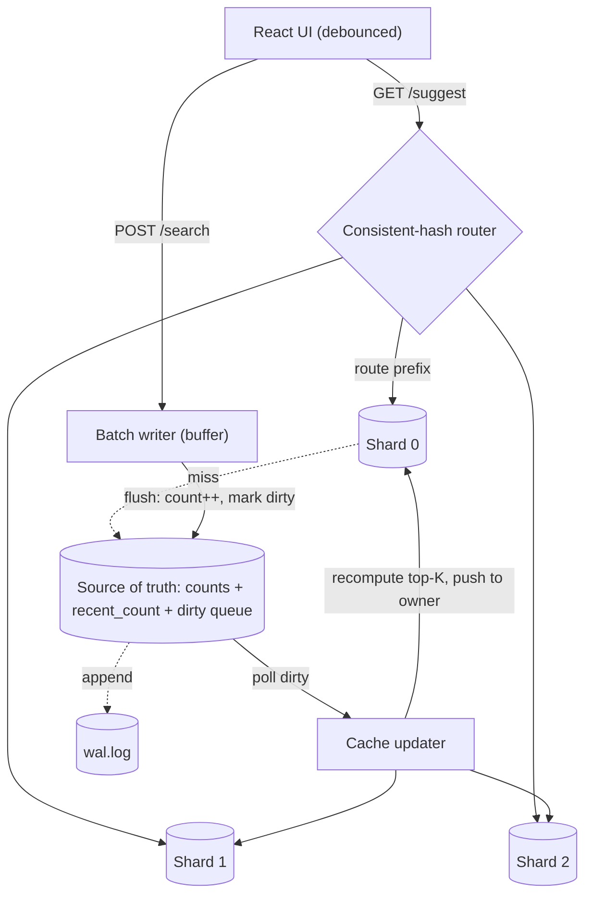

# Distributed Search Typeahead

A low-latency autocomplete service. A **durable source of truth** holds the
authoritative query counts; a set of **cache shards** holds a *derived* per-prefix
top-K that a **consistent-hash router** reads from. A background **cache-updater**
keeps the shards in sync from the source, so a live search becomes visible in
suggestions on the shard that actually serves that prefix. Searches are absorbed
by a **write-behind batch writer** instead of hitting the store on every request.

Built on Node + Express with a React frontend. Every distributed component
(source of truth, cache shards, load balancer, cache-updater) is implemented as an
in-process module that maps 1:1 to a real service, so the whole system runs with
one command and every design choice is defensible.



_Reads (`/suggest`) route through the consistent-hash router to the shard that
owns the prefix. Writes (`/search`) are buffered, batch-flushed into the source of
truth, which marks prefixes dirty; the cache-updater recomputes those prefixes'
top-K and pushes them to the owning shard._

## Assignment coverage

| Rubric component (marks) | Where it lives |
| --- | --- |
| **Basic implementation (60)** | dataset ingestion `scripts/generateDataset.js`; suggestions UI `frontend/`; `GET /suggest` + `POST /search` `src/server.js`; query-count store `src/sourceOfTruth.js`; distributed cache over 3 shards by consistent hashing `src/cluster.js` + `src/consistentHash.js`; cache miss → source fallback. |
| **Trending searches (20)** | recency-aware `/suggest?rank=recency` + decayed `recent_count` → [Trending & recency ranking](#trending--recency-aware-ranking-7); global board `GET /trending`. Demo: `npm run demo:recency`. |
| **Batch writes (20)** | in-memory buffer + size/interval flush `src/batchWriter.js`; **~50× write reduction measured** ([PERFORMANCE.md](./PERFORMANCE.md)); [failure trade-offs](#batch-writes--failure-trade-offs-8). |
| **Deliverables (§12)** | README (this) · [API docs](./docs/API.md) · [HLD](./HLD.md) · [Performance report](./PERFORMANCE.md) · [screenshots](#screenshots) · [dataset](#dataset). |

Endpoints: `GET /suggest?q=&rank=basic|recency`, `POST /search`, `GET /trending`,
`GET /cache/debug?prefix=`, `GET /metrics`, `GET /ring/distribution`. Full
reference → [`docs/API.md`](./docs/API.md).

## How it works

| Concern | Where | What |
| --- | --- | --- |
| Consistent hashing | `src/consistentHash.js` | MD5 hash ring with 150 virtual nodes per shard. `getNode(key)` maps any prefix/query → shard. Same ring used by the router and the cache-updater. |
| Source of truth | `src/sourceOfTruth.js` | Authoritative `count` (in a Trie) + decaying `recent_count` + a `dirty` set of prefixes — the cache work queue. |
| Prefix index | `src/trie.js` | Trie with a cached top-K per node, so a suggestion is "walk to the node, read its list" — no scan, no read-time sort. Built bottom-up in one pass at load. |
| Search | `src/server.js` `POST /search` | Buffers the query in memory, returns `{ "message": "Searched" }` immediately. |
| Batch writer | `src/batchWriter.js` | At `BATCH_SIZE` (100) — or after `FLUSH_INTERVAL_MS` — dedups counts, applies them to the source in one pass, bumps the trending board, appends to the WAL. |
| Cache updater | `src/cacheUpdater.js` | Polls the dirty set, recomputes each prefix's top-K (both orderings) from the source, and pushes them to the shard `route(prefix)` owns. Also runs the decay loops. |
| Cache shard | `src/shard.js` | Holds per-prefix top-K (`basic` + `recency`) with TTL, plus a local trending board. `putCache` atomically replaces an entry (one writer per shard). |
| Suggest | `src/server.js` `GET /suggest` | Router → owning shard → cached top-K (HIT). On a miss it derives from the source (`source:"db"`) and warms the shard. `rank=basic` = all-time count; `rank=recency` = blended score (§7). |
| Recency ranking | `src/sourceOfTruth.js` | Second per-prefix ordering by `log2(1+count) + 3·log2(1+recent_count)`. `recent_count` is bumped per search and decayed, so active queries outrank stale giants (§7). |
| Cache debug | `GET /cache/debug?prefix=` | Hashes the prefix, reports which shard owns it and whether it is cached (HIT/MISS) per ranking. |
| Metrics | `GET /metrics` | Cache hit rate, suggest latency p95, batch write reduction, dirty-queue depth. Powers [`PERFORMANCE.md`](./PERFORMANCE.md). |
| Trending | `GET /trending` | Each shard keeps a local trending board (query lives on one shard); the cluster merges them, decayed periodically. |
| Load balancer / router | `src/cluster.js` | Hashes `/suggest` and the updater's pushes with the same ring, routes to the owning shard, and logs each routing decision. |
| Seeding | `scripts/generateDataset.js` | ~125k `query,count` rows, Zipf-distributed; loaded into the source, then short prefixes are pre-warmed into the shards. |
| Frontend | `frontend/` | React, 150ms-debounced suggestions, keyboard navigation, a ranking toggle, and a "Trending right now" board. |

### Data model

- **Source of truth** (`SourceOfTruth`): a Trie of `query → count` (permanent),
  a `recent_count` map (a decaying recency signal, §7), and a `dirty` set of
  prefixes (the cache work queue). *In production: Postgres `query_counts` +
  `dirty_prefixes`.*
- **Cache shard** (`ShardNode`): per-prefix `basic` top-K (by count) and `recency`
  top-K (blended), each with a TTL, plus a `trending` board. *In production: a
  Redis instance with `q:`/`qr:`/`trending` sorted sets.*

## How the write path stays consistent across shards

A search for query `q` routes to `hash(q)`'s shard, but `/suggest?q=p` is read from
`hash(p)`'s shard — a **different** shard. If a write updated the cache directly, a
live search would land on the wrong shard and never appear under the prefix being
typed.

The fix: **the source of truth is authoritative, and the cache-updater computes
each prefix's top-K and pushes it to the shard that owns *that prefix*
(`route(prefix)`).** Writes only touch the source and mark prefixes dirty; the
updater is the single writer that refreshes each shard. So every live search
becomes visible in suggestions on the exact shard that serves its prefix.

## Dataset

`backend/data/queries.csv` — `query,count` rows generated by
`scripts/generateDataset.js`: brand × product × modifier combinations with
**Zipf-distributed counts** (`count = C / rank^1.05`), the shape real search
traffic has, so ranking by count is meaningful out of the box.

| Metric | Value |
| --- | --- |
| Unique queries | **125,459** |
| Total search events (Σ counts) | **18,781,735** |
| Top query | `jbl watch wireless` (2,302,097) |
| Distribution | Zipfian (long tail) |

Exceeds the §3 100k-query minimum. **To use a real dataset instead:** drop any CSV
with a `query,count` header at `backend/data/queries.csv` and restart — no code
changes. (Good sources: AOL search log, Wikipedia page titles + pageviews, Kaggle
"English word frequency".)

**Loading:** `npm run generate` writes the CSV; `npm start` loads it into the
source of truth (one fast bottom-up Trie build) and pre-warms the shard caches.

## Trending & recency-aware ranking (§7)

`/suggest` supports **two orderings over the same candidate set**, via the same API:

- `rank=basic` (default, the 60% version) → sort by **all-time `count`**.
- `rank=recency` (the enhanced 20% version) → a **blended score** so recently-active
  queries outrank stale historical giants:

```
score = HIST_WEIGHT · log2(1 + count) + RECENCY_WEIGHT · log2(1 + recent_count)
        (defaults: HIST_WEIGHT = 1, RECENCY_WEIGHT = 3)
```

The five design questions §7 asks, answered:

1. **How recent searches are tracked.** Every batched `/search` increments both
   `count` (permanent) and `recent_count` (recent activity) on the query.
2. **How recent activity affects ranking.** `recent_count` enters the score with
   weight `RECENCY_WEIGHT` (3×). Both signals are **log2-compressed** (diminishing
   returns), so a *burst* on a modestly-popular query can overtake an all-time
   leader, while a *single* search cannot (no flapping).
3. **How short-lived spikes are prevented from ranking forever.** The cache-updater
   **decays `recent_count`** (`×0.5` each interval) and re-marks the affected
   prefixes dirty, so the *served* recency cache fades; `count` is never decayed,
   so a spike converges back to its true all-time rank.
4. **How the cache reflects ranking changes.** The updater recomputes the blended
   top-K whenever a prefix is dirtied (every search **and** every decay tick) and
   pushes the refreshed list to the owning shard — reads stay O(1).
5. **Trade-offs.** Derive-time blending keeps `/suggest` reads fast (recency adds
   no read latency) at the cost of a second cache per prefix (≈2× cache memory) and
   eventual consistency (recency lags a search by one updater cycle).

**See it:**

```bash
npm run demo:recency   # bursts a query, prints basic vs recency side-by-side
```

```
Prefix "ap" — AFTER burst:
  #   rank=basic (all-time count)        rank=recency (blended §7)
  1   apple console waterproof (43856)   » apple keyboard ultra [recent=200]
  2   apple desk for gaming (21559)        apple console waterproof
```

Basic ordering is untouched; the bursting query jumps to #1 in recency, then
decays back to its true rank over time.

## Batch writes & failure trade-offs (§8)

`POST /search` never writes synchronously. The query is pushed to an in-memory
buffer and the dummy response returns immediately. A flush triggers the instant the
buffer hits `BATCH_SIZE` (100), with a timed `FLUSH_INTERVAL_MS` safety net for low
traffic. A flush **dedups counts in memory** (a `Map`), applies them to the source
in one pass, bumps the trending board, and appends to the WAL.

**Measured: ~50 searches per write (~50× / 98% write reduction)** — see
[PERFORMANCE.md](./PERFORMANCE.md).

**Failure trade-offs (the honest part §8 asks for):**

- **Crash before flush loses the buffered window** — up to `BATCH_SIZE−1` searches.
  Acceptable because counts are **approximate popularity signals**, not orders —
  losing a few increments out of millions never changes a top-K.
- **Mitigations in place:** `SIGINT`/`SIGTERM` flush the buffer before exit; each
  flush appends to a **write-ahead log** (`data/wal.log`) that is **replayed on
  startup**, so counts survive a normal restart (verified).
- **Knobs make the trade explicit:** larger `BATCH_SIZE` → better reduction but more
  data at risk; shorter `FLUSH_INTERVAL_MS` → fresher data, smaller batches.

## Performance

Headline numbers from `npm run bench` against the running server (full methodology
→ [PERFORMANCE.md](./PERFORMANCE.md)):

| Metric | Value |
| --- | --- |
| `/suggest` latency **p95** (server-side) | **~0.03 ms** |
| `/suggest` p95 (client, incl. HTTP loopback) | ~1.1 ms |
| Cache hit rate | **99.9%** |
| Write reduction from batching | **~50×** |
| Adding a 4th shard re-maps | **~25%** of keys (naive `hash % N` ≈ 75%) |
| Dataset load (125k) | ~2–3 s (one-pass bottom-up build) |

```bash
npm run bench               # latency p50/p95/p99 + hit rate + write reduction
npm test                    # consistent-hash determinism, balance, stability
curl -s localhost:4000/metrics   # live counters
```

## API

Full reference with request/response examples → [`docs/API.md`](./docs/API.md).

## Screenshots

| Suggestions (debounced, prefix-highlighted) | Trending board |
| --- | --- |
| _add `docs/screenshots/ui-suggestions.png`_ | _add `docs/screenshots/ui-trending.png`_ |

## Run it

Two terminals. **Node 18+** (uses global `fetch`).

```bash
# 1) Backend
cd backend
npm install
npm run generate        # writes data/queries.csv (~125k queries)
npm start               # http://localhost:4000

# 2) Frontend
cd frontend
npm install
npm run dev             # http://localhost:5173  (proxies /api -> backend)
```

Open **http://localhost:5173**, type a prefix (e.g. `apple`, `samsung`, `nike`),
toggle **Basic ↔ Recency-aware**, submit searches, and watch the **Trending** board.

### Tests, benchmark & demo

```bash
cd backend
npm test                # consistent-hash ring guarantees
npm run bench           # performance report
npm run demo:recency    # §7 basic-vs-recency, before/after a burst
```

## Configuration (env)

| Var | Default | Purpose |
| --- | --- | --- |
| `PORT` | `4000` | Backend port |
| `SHARDS` (in `config.js`) | 3 shards | Logical cache nodes |
| `VNODES` | `150` | Virtual nodes per shard on the ring |
| `CACHE_TTL_MS` | `60000` | Cache entry expiry |
| `CACHE_K` | `30` | Depth of each derived top-K (≥ `SUGGEST_LIMIT`) |
| `SUGGEST_LIMIT` / `TRENDING_LIMIT` | `10` / `10` | Result counts (§2: show 10) |
| `BATCH_SIZE` | `100` | Buffer size that triggers a flush |
| `FLUSH_INTERVAL_MS` | `2000` | Safety-net flush for low traffic |
| `UPDATER_INTERVAL_MS` / `UPDATER_BATCH` | `500` / `500` | Cache-updater cadence + batch |
| `HIST_WEIGHT` / `RECENCY_WEIGHT` | `1` / `3` | Recency blend weights (§7) |
| `RECENCY_DECAY_FACTOR` / `RECENCY_DECAY_INTERVAL_MS` | `0.5` / `30000` | `recent_count` decay (§7) |
| `TRENDING_DECAY_FACTOR` / `TRENDING_DECAY_INTERVAL_MS` | `0.9` / `60000` | Trending board decay |
| `MAX_PREFIX_LEN` | `32` | Cap prefix fan-out per query |

## Repo layout

```
backend/
  src/   trie · consistentHash · sourceOfTruth · shard · cluster
         cacheUpdater · batchWriter · datastore · metrics · config · server
  scripts/  generateDataset · benchmark · demoRecency
  test/  hashRing.test.js
frontend/
  src/   App.jsx · api.js · styles.css · main.jsx
docs/  API.md
HLD.md · PERFORMANCE.md
```
